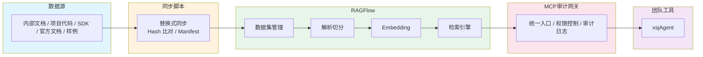

# 鸿蒙知识库建设方案

## 一、方案背景与目标

### 1.1 背景
团队在 HarmonyOS/OpenHarmony 开发中面临以下痛点：
- 官方文档分散，查找效率低
- 内网环境无法直接访问外部文档，查询困难
- 团队经验难以沉淀和复用
- 编码工具缺乏鸿蒙领域知识

### 1.2 目标
建设面向团队内部及新视界接入算法团队的鸿蒙研发知识库，实现：
1. **问题解答**：准确回答新视界常见问题及鸿蒙 API、生命周期、状态管理等技术问题
2. **智能检索**：编码工具能快速检索相关知识，提升开发效率
3. **持续更新**：建立可持续的数据同步机制，避免知识过期
4. **使用追踪**：记录团队提问和检索情况，持续优化文档质量

## 二、总体架构

## 三、数据源规划

| 数据集 | 内容 | 优先级 | 更新策略 |
|--------|------|--------|----------|
| `hm-internal-guides` | 团队规范、FAQ、踩坑记录（同步新视界所有公开文档，不同步私有文档，需评审） | 最高 | 每周更新 |
| `hm-project-code` | 项目代码、组件库（需评审） | 中高 | 每日更新 |
| `hm-deveco-sdk-api` | DevEco SDK API 签名 | 高 | 每月更新 |
| `hm-harmonyos-docs` | HarmonyOS 官方文档 | 中高 | 每月更新 |
| `hm-openharmony-docs` | OpenHarmony 开源文档 | 中 | 每月更新 |
| `hm-harmonyos-samples` | 官方样例代码 | 中 | 每月更新 |

**回答优先级**：团队内部文档 > SDK API 签名 > 官方文档 > 开源文档 > 样例代码

**图片数据说明**：当前方案不纳入图片数据，原因如下：
- **RAGFlow**：支持上传图片文件，但图片内容需通过OCR提取文字后才能被检索，直接图片embedding效果有限
- **Embedding模型**：Qwen3-Embedding-8B为文本模型，不支持图片向量化，需额外部署多模态模型
- **编码工具**：opencode、Claude Code等工具主要消费文本和代码，图片呈现能力有限
- **成本收益**：图片OCR+多模态embedding会显著增加部署复杂度，但鸿蒙编码问题的核心证据来自API签名、文档和代码样例

**处理方式**：关键架构图、流程图由维护人补充Markdown文字说明，图片保留原始链接作为引用

## 四、分阶段实施计划

### 阶段一：知识库可用

**目标**：让团队工具能查到鸿蒙知识库

**核心工作**：
1. 部署 RAGFlow 环境
2. 配置 Qwen3-Embedding-8B 模型
3. 创建核心数据集（6 个）
4. 导入首批数据：
   - DevEco SDK `.d.ts` 文件
   - HarmonyOS 文档快照
   - 第一批内部 FAQ
5. 启动 MCP 服务
6. 配置 xsjAgent 接入 MCP
7. 编写 `harmony-kb` Skill

**验收标准**：
- ✅ 能通过 MCP 查询知识库
- ✅ 能回答 API 签名、生命周期、状态管理等基础问题

### 阶段二：同步与审计可用

**目标**：数据可持续更新，问题可追踪

**核心工作**：
1. 实现数据同步脚本
   - Manifest 机制（文件 Hash 比对）
   - 支持新增、更新、删除识别
   - 生成同步报告
2. 建设 MCP 审计网关
   - 记录问题、检索命中、耗时、错误
   - 统一团队入口

**验收标准**：
- ✅ 重复执行同步不会产生重复文档
- ✅ 文件变化后能自动更新 RAGFlow 文档
- ✅ 能查看问题日志和无命中问题

### 阶段三：持续优化

## 五、关键技术方案

> 具体技术细节在实施阶段细化

### 5.1 数据同步机制
- **替换式更新**：RAGFlow 不支持增量更新，文件变化时需删除旧文档后重新上传
- **变更识别**：脚本维护一份本地文件清单，记录每个文件的路径、SHA256 hash 和对应的 RAGFlow document_id。每次同步时扫描本地文件，与清单比对，识别出新增（清单无记录）、变化（hash 不同）和删除（本地已消失）的文件
- **精确删除**：变化和删除的文件通过清单找到 document_id，调用 RAGFlow API 精确删除，不需要全量重建
- **同步报告**：每次同步输出新增、更新、删除、失败的数量和文档列表

### 5.2 检索策略
- **混合检索**：向量检索 + 关键词检索
- **初始参数**：
  - `top_k`: 20-50
  - `similarity_threshold`: 0.2 起步
  - `vector_similarity_weight`: 0.3-0.5
- **评测验证**：准备 30-50 个典型问题验证召回质量

### 5.3 审计网关
- **统一入口**：团队工具都连接同一个 MCP 地址
- **权限控制**：普通成员只能检索，不能上传和解析
- **数据闭环**：记录问题、命中、回答和反馈

### 5.4 权限控制

| 角色 | 权限 |
|------|------|
| 知识库管理员 | 数据源配置、上传、解析、删除、模型配置 |
| 文档维护人 | 更新自有文档、查看审计、处理反馈 |
| 团队成员 | 通过 MCP 查询 |

**安全策略**：
- RAGFlow 部署在内网，不对外暴露
- RAGFlow API Key 只保存在服务端
- 普通成员只访问 MCP 审计网关，不直连 RAGFlow
- MCP 网关只暴露检索工具，管理操作仅限管理员

## 六、资源需求

- RAGFlow 服务器（内网部署）
- Qwen3-Embedding-8B 模型服务
- 数据库（审计日志存储）
- 外网数据拉取机器

## 七、下一步行动

1. **确认方案**：评审并确认本方案
2. **资源准备**：确认服务器、模型、人力等资源
3. **启动阶段一**：部署 RAGFlow，导入首批数据
4. **试点验证**：选择 2-3 个团队成员试点使用
5. **迭代优化**：根据使用反馈持续改进

---

**方案特点**：先可用、再可控、后优化，快速形成能力，保留扩展空间。

---

## 问题记录

### RAGFlow 文件内容更新限制（v0.25.1）

**现状**：RAGFlow 不支持文件内容原地更新，标准流程为「删旧→传新→重解析」。

**原因**：RAG 分块特性决定，原文改动会导致 chunk 边界漂移，局部更新易造成语义混乱。

**支持的增量场景**：
- 元数据/配置更新：标题、标签、解析参数可原地修改
- 外部数据源同步：S3/Notion 等连接器按哈希识别变更文件，全量替换
- Chunk 级局部更新：可手动微调单个 chunk，不适合文件整体更新

**最佳实践**：
- 日常更新：删旧传新，简单可靠
- 需保留 ID：先传新文件→验证正常→删旧文件
- 高频更新：用外部数据源连接器自动同步

---

## 数据源来源说明

各数据集的数据来源和获取方式：

| 数据集 | 来源 | 获取方式 | 格式 |
|--------|------|----------|------|
| `hm-deveco-sdk-api` | DevEco SDK API签名 | 从DevEco安装目录提取`.d.ts`文件，按模块整理 | `.d.ts` |
| `hm-harmonyos-docs` | HarmonyOS Next官方文档 | 从华为开发者文档站爬取网页，转换成Markdown | Markdown |
| `hm-openharmony-docs` | OpenHarmony开源文档 | 从Gitee仓库拉取，或从文档站爬取转换 | Markdown |
| `hm-harmonyos-samples` | 官方样例代码、Codelabs | 从Gitee/GitHub拉取样例仓库 | ArkTS、TS |

**数据获取要点**：
- 内部文档：优先整理团队已有文档，避免重复建设
- SDK API：跟随DevEco版本更新，保持API签名时效性
- 官方文档：定期爬取更新，注意版本对应关系
- 样例代码：筛选高质量样例，保留完整工程结构